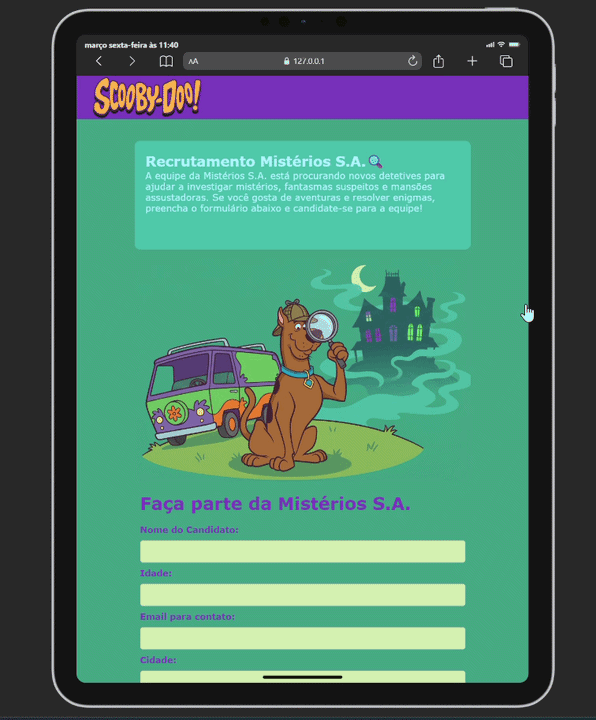

# 🐶 Formulário Scooby-Doo

Projeto desenvolvido como atividade acadêmica com o objetivo de praticar conceitos de desenvolvimento web utilizando HTML, CSS e JavaScript.

---

## 🎬 Demonstração

  
Prévia visual da página do projeto:

  

## 🚀 Tecnologias utilizadas

- HTML5
- CSS3
- JavaScript

---

## 📋 Funcionalidades

- Preenchimento de formulário
- Interação com JavaScript
- Interface temática inspirada no Scooby-Doo
- Estrutura simples e organizada para aprendizado

---

## 📁 Estrutura do projeto

📦 entrega-fase-1-formulario-html-css-javascript
┣ 📂 assets
┣ 📄 index.html
┣ 📄 style.css
┗ 📄 script.js

---
## 🎯 Objetivo

Este projeto foi desenvolvido com fins educacionais, visando:

- Praticar estruturação de páginas com HTML
- Aplicar estilização com CSS
- Implementar interações com JavaScript
- Aprender versionamento de código com Git e GitHub

---

## ⚠️ Aviso

Este projeto utiliza imagens do personagem Scooby-Doo apenas para fins educacionais e não comerciais.  
Todos os direitos pertencem à Warner Bros.

---

## 👩‍💻 Autora

Desenvolvido por **Samires do Carmo**
